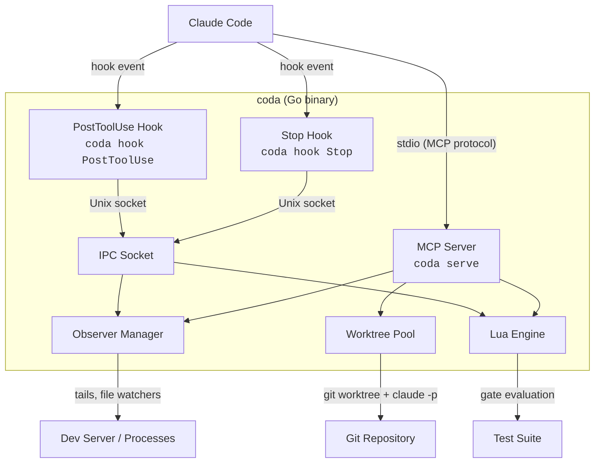
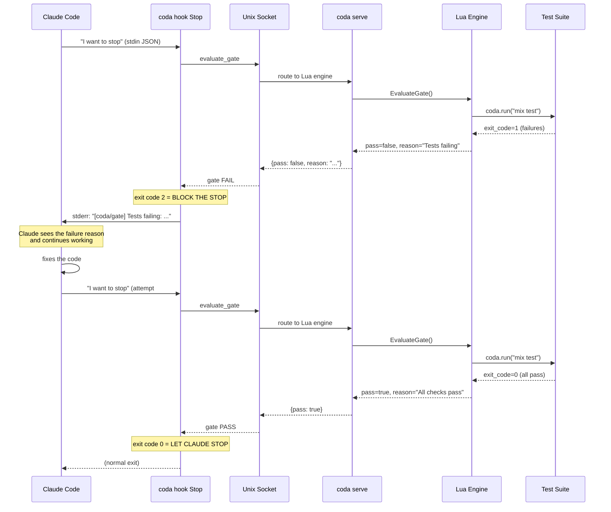
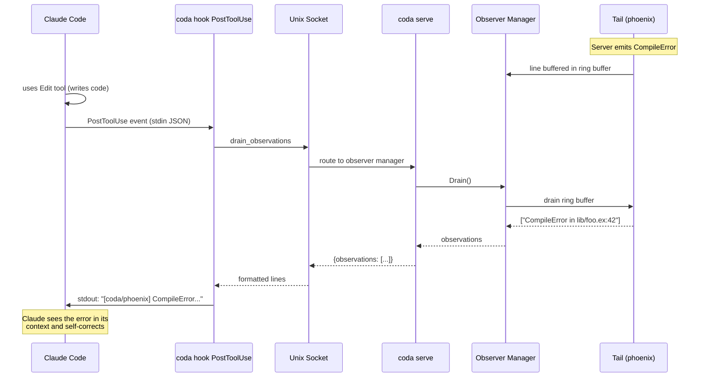
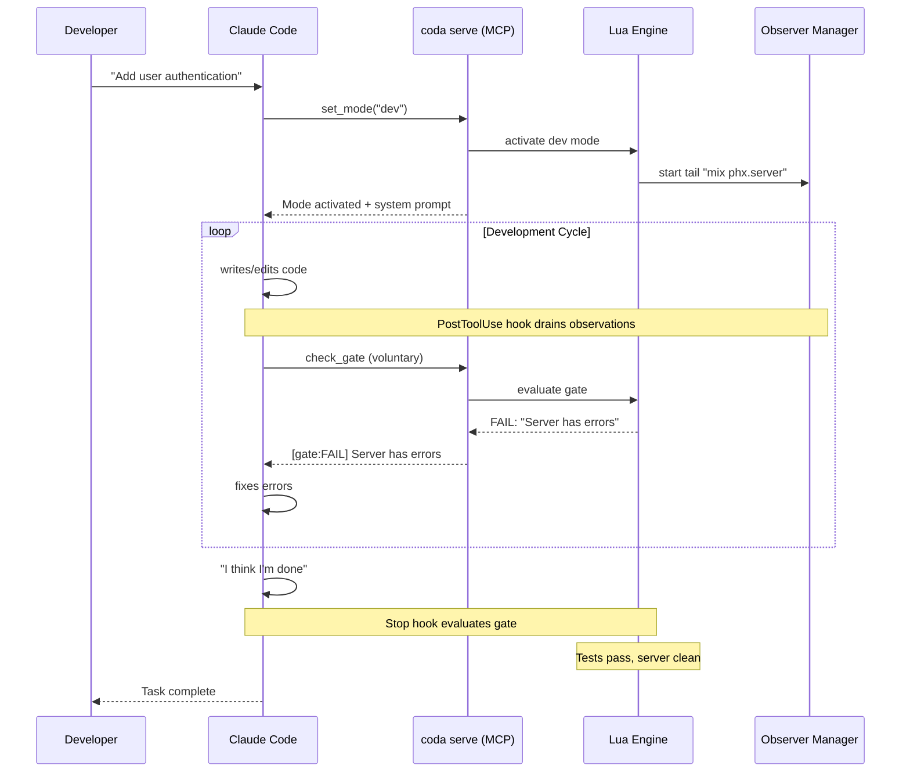
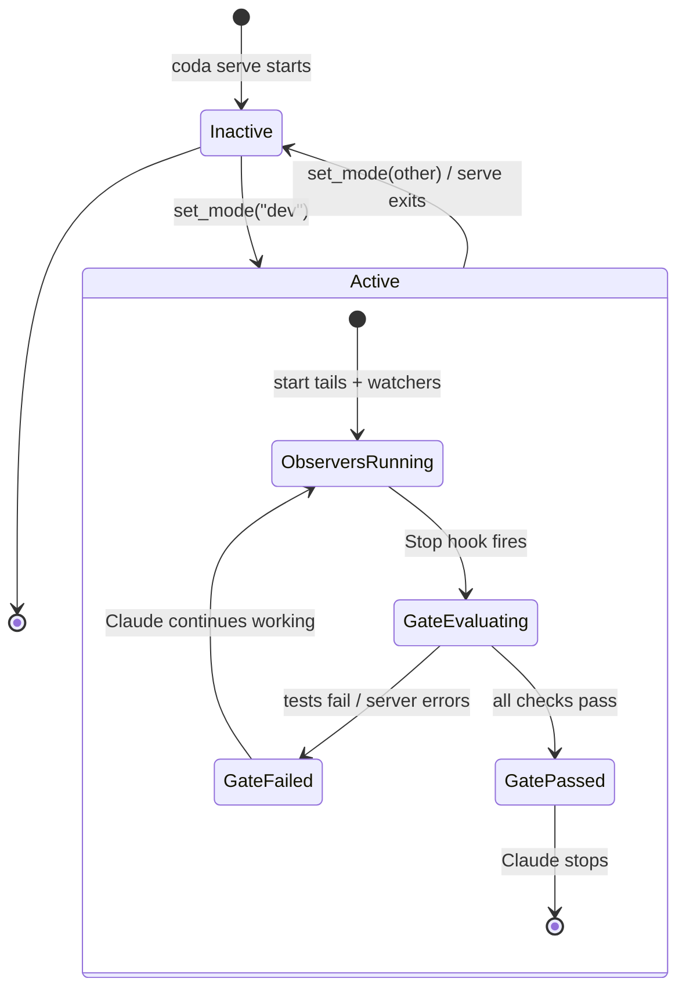
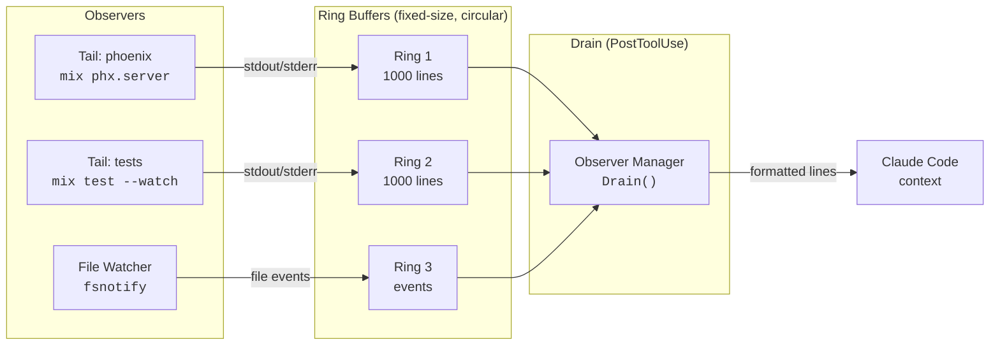
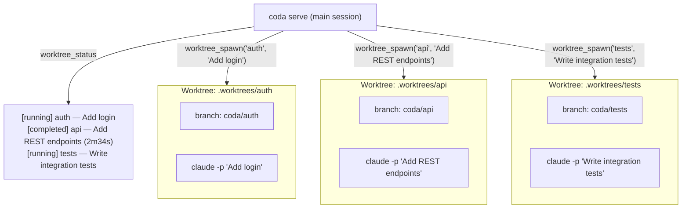
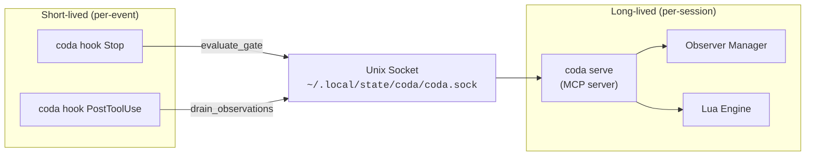
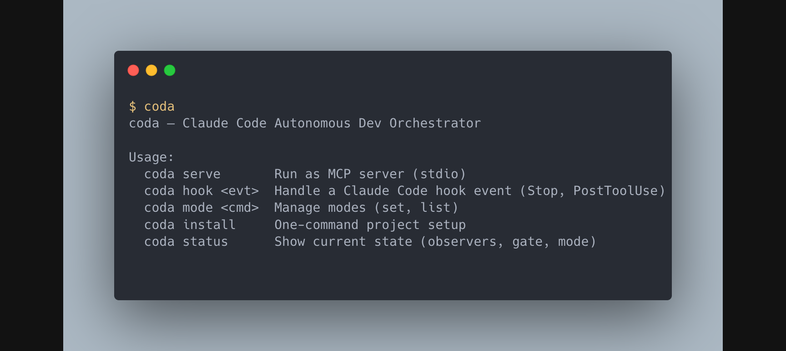
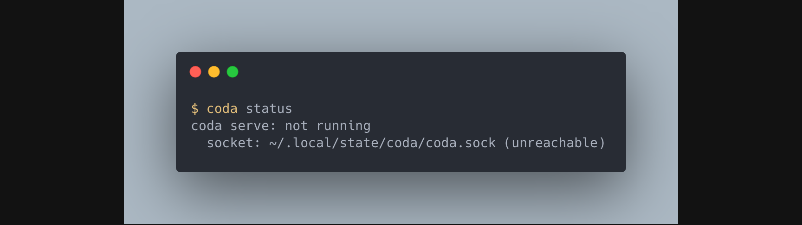

# coda


**Close the loop. Claude Code stops when your system is healthy, not when it feels done.**

Coda is an autonomous dev orchestrator for [Claude Code](https://docs.anthropic.com/en/docs/claude-code). It turns Claude from an open-loop assistant — one that stops when *it thinks* it's done — into a closed-loop system that stops when your **server compiles, tests pass, and the gate clears**.

---

## The Problem

Without Coda, Claude Code operates in an **open loop**:

```
Developer → Claude Code → writes code → "I'm done!" → Developer checks → finds errors → re-prompts
```

The developer *is* the feedback loop. Every cycle through a human costs minutes.

With Coda, Claude Code operates in a **closed loop**:

```
Developer → Claude Code → writes code → tries to stop → Coda checks gate → tests failing?
    ↑                                                                            │
    └────────────────── Claude keeps working ←───────────────────────────────────┘
```

Coda observes your running dev server, your test suite, your file system — and **blocks Claude from stopping** until the system is actually healthy. No human in the loop. No re-prompting.

---

## Architecture Overview



---

## How It Works

### The Stop Hook Gate — The Money Diagram

This is the core mechanism. When Claude Code decides it's done, the Stop hook intercepts and asks Coda: "Is the system actually healthy?"



**Exit code 2** is the magic number. Claude Code interprets it as "the hook blocked the stop — here's why" and feeds `stderr` back to the model as context.

### PostToolUse Observation Injection

After every tool call Claude makes, Coda injects any pending observations (server errors, file changes) into Claude's context — without Claude having to ask.



### Full Dev Session Lifecycle



---

## MCP Tools

Coda exposes 9 tools to Claude Code over MCP:

| Tool | Description | Key Parameters |
|------|-------------|----------------|
| `tail_server` | Start, stop, or read a tailed process | `action` (start/stop/read), `command`, `id` |
| `read_tail` | Get last N lines from a tailed process | `id`, `lines` (default 50) |
| `get_observations` | Drain all pending observations from all observers | — |
| `run_tests` | Execute a test command, return structured pass/fail | `command` (default `mix test`) |
| `check_gate` | Evaluate the active mode's completion gate | — |
| `set_mode` | Switch the active Lua mode | `mode` (e.g. `"dev"`) |
| `screenshot` | Take a CDP screenshot of a browser page | `url` (default `localhost:4000`) |
| `worktree_spawn` | Create a git worktree + launch parallel Claude session | `name`, `prompt` |
| `worktree_status` | Check status of all parallel worktree sessions | — |

---

## Lua Modes

Modes are the central configuration unit. A mode defines **what to observe**, **what to tell Claude**, and **when Claude can stop**.

```lua
-- dev.lua — Development mode for coda
local coda = require("coda")

coda.define_mode({
    name = "dev",

    -- Injected into Claude's context when mode activates
    system_prompt = [[You are in dev mode. After every code change:
1. Check the server tail for compilation errors
2. Run the test suite
3. Fix any failures before moving on

Never stop while the gate is failing. Use check_gate to verify.]],

    -- Which MCP tools this mode needs
    tools = {"tail_server", "read_tail", "run_tests", "check_gate", "get_observations"},

    -- Processes to observe (started automatically on mode activation)
    observers = {
        {type = "tail", command = "mix phx.server", id = "phoenix"},
    },

    -- The completion gate — must return (bool, string)
    gate = function()
        -- Check 1: Server tail for errors
        local output = coda.get_tail_output("phoenix")
        if output and (output:find("error") or output:find("Error")) then
            return false, "Server has errors:\n" .. output:sub(1, 500)
        end

        -- Check 2: Test suite
        local result = coda.run("mix test --no-color 2>&1")
        if result.exit_code ~= 0 then
            return false, "Tests failing:\n" .. result.output:sub(-500)
        end

        return true, "All checks pass"
    end,
})
```

### Mode Lifecycle



---

## Observer System

Observers are background processes that feed data into Claude's context. They run continuously and buffer output in ring buffers that get drained on each `PostToolUse` hook.



The ring buffer design means Coda never grows unbounded — old lines are overwritten, and only the most recent output matters.

---

## Worktrees

Coda can spawn parallel Claude Code sessions in isolated git worktrees. Each session works on its own branch without interfering with the main session.



---

## IPC Architecture

Hooks are **short-lived** processes (spawned per-event by Claude Code). The MCP server is a **long-lived** process (runs for the entire session). They communicate over a Unix domain socket.



This split is necessary because Claude Code hooks are ephemeral — they start, do one thing, and exit. But observers need to run continuously. The IPC bridge connects the two worlds.

---

## Quick Start

```bash
# Build
cd ~/Desktop/coda
go build -o coda .

# Install into your project
cd /path/to/your/project
~/Desktop/coda/coda install
```

```
coda install — setting up Claude Code integration

1. Registering MCP server... OK
2. Installing hooks... OK
3. Installing /mode skill... OK
4. Copying default Lua scripts... OK

Done! Start Claude Code and use /mode dev to activate dev mode.
```

```bash
# Check status
coda status
```

```
coda serve: not running
  socket: ~/.local/state/coda/coda.sock (unreachable)
```

<details>
<summary>Terminal screenshots</summary>

<br/>





</details>

Once Claude Code starts and connects:

```
coda serve: running
  socket: ~/.local/state/coda/coda.sock
  active mode: dev
  available modes: dev
  active tails: phoenix
  gate: PASS — All checks pass
```

### CLI Reference

```
coda — Claude Code Autonomous Dev Orchestrator

Usage:
  coda serve       Run as MCP server (stdio)
  coda hook <evt>  Handle a Claude Code hook event (Stop, PostToolUse)
  coda mode <cmd>  Manage modes (set, list)
  coda install     One-command project setup
  coda status      Show current state (observers, gate, mode)
```

---

## Project Structure

```
coda/
├── main.go                  # CLI entrypoint — routes subcommands
├── go.mod                   # Go 1.24, MCP SDK v0.2.0, gopher-lua v1.1.1
│
├── cmd/                     # Subcommand implementations
│   ├── serve.go             # Start MCP server + IPC listener
│   ├── hook.go              # Dispatch hook events (Stop, PostToolUse)
│   ├── install.go           # One-command project setup
│   ├── mode.go              # Manage modes (set, list)
│   └── status.go            # Show current state via IPC
│
├── mcp/                     # MCP server + tool registration
│   ├── server.go            # Server struct, wires observer/lua/worktree
│   └── tools.go             # 9 MCP tools (tail, test, gate, screenshot, worktree)
│
├── hooks/                   # Claude Code hook handlers (short-lived)
│   ├── dispatch.go          # Hook input parsing (stdin JSON)
│   ├── stop.go              # THE gate — exit 2 blocks Claude from stopping
│   ├── posttool.go          # Drain observations after every tool use
│   ├── ipc.go               # Unix socket client for hook→serve comms
│   └── install.go           # Patch .claude/settings.json with hook config
│
├── observer/                # Background observation system
│   ├── manager.go           # Coordinates tails, watchers; drain interface
│   ├── tail.go              # Process tailer (shell command → ring buffer)
│   ├── ring.go              # Thread-safe circular buffer
│   ├── ring_test.go         # Ring buffer tests
│   ├── filewatch.go         # fsnotify file watcher
│   └── screenshot.go        # CDP screenshot via chromedp
│
├── lua/                     # Lua scripting engine
│   ├── engine.go            # VM management, coda module, gate evaluation
│   ├── engine_test.go       # Engine tests
│   ├── mode.go              # Mode struct and config types
│   └── recipe.go            # Recipe execution (planned)
│
├── worktree/                # Parallel session management
│   ├── worktree.go          # Git worktree create/remove
│   ├── pool.go              # Session pool (spawn, status, cleanup)
│   └── session.go           # Individual Claude session (claude -p)
│
├── lua.d/                   # Bundled Lua scripts (copied on install)
│   ├── modes/
│   │   └── dev.lua          # Default dev mode
│   └── recipes/
│       └── test_and_fix.lua # Test-and-fix recipe
│
└── config/                  # XDG path resolution
    └── paths.go             # ~/.config/coda, ~/.local/state/coda
```

---

## Configuration

### XDG Paths

| Path | Purpose |
|------|---------|
| `~/.config/coda/` | User configuration root |
| `~/.config/coda/lua/modes/` | Mode scripts (e.g. `dev.lua`) |
| `~/.config/coda/lua/recipes/` | Recipe scripts |
| `~/.local/state/coda/` | Runtime state |
| `~/.local/state/coda/coda.sock` | IPC Unix domain socket |

### Lua API

| Function | Description |
|----------|-------------|
| `coda.define_mode({...})` | Register a mode with name, system_prompt, tools, observers, gate |
| `coda.get_tail_output(id)` | Read all buffered output from a named tail |
| `coda.run(command)` | Run a shell command; returns `{exit_code, output}` |

### Mode Fields

| Field | Type | Description |
|-------|------|-------------|
| `name` | string | Mode identifier (e.g. `"dev"`) |
| `system_prompt` | string | Injected into Claude's context on activation |
| `tools` | string[] | MCP tools this mode needs |
| `observers` | table[] | Processes/files to observe (`{type, command, id}`) |
| `gate` | function | Returns `(bool, string)` — pass/fail + reason |

---

## Dependencies

| Package | Version | Purpose |
|---------|---------|---------|
| [modelcontextprotocol/go-sdk](https://github.com/modelcontextprotocol/go-sdk) | v0.2.0 | MCP server (stdio transport) |
| [yuin/gopher-lua](https://github.com/yuin/gopher-lua) | v1.1.1 | Embedded Lua 5.1 VM |
| [chromedp/chromedp](https://github.com/chromedp/chromedp) | v0.14.2 | CDP browser automation (screenshots) |
| [fsnotify/fsnotify](https://github.com/fsnotify/fsnotify) | v1.9.0 | File system event watcher |

---

## C4 Context Diagram


<details>
<summary>PlantUML source</summary>

```plantuml
@startuml
!include https://raw.githubusercontent.com/plantuml-stdlib/C4-PlantUML/master/C4_Context.puml

title Coda — System Context Diagram

Person(dev, "Developer", "Uses Claude Code for AI-assisted development")
System(claude, "Claude Code", "AI coding assistant CLI by Anthropic")
System(coda, "Coda", "Autonomous dev orchestrator. MCP server + hooks that close the feedback loop.")

System_Ext(git, "Git Repository", "Source code + worktree branches")
System_Ext(server, "Dev Server", "e.g. Phoenix, Next.js — tailed for errors")
System_Ext(tests, "Test Suite", "e.g. mix test, pytest — gate evaluation")
System_Ext(browser, "Browser", "CDP screenshots via chromedp")

Rel(dev, claude, "Gives tasks")
Rel(claude, coda, "MCP tools + Hooks")
Rel(coda, git, "Worktree management")
Rel(coda, server, "Process tailing")
Rel(coda, tests, "Runs tests, evaluates gate")
Rel(coda, browser, "CDP screenshots")
@enduml
```

</details>

---

## License

Private — not yet published.
